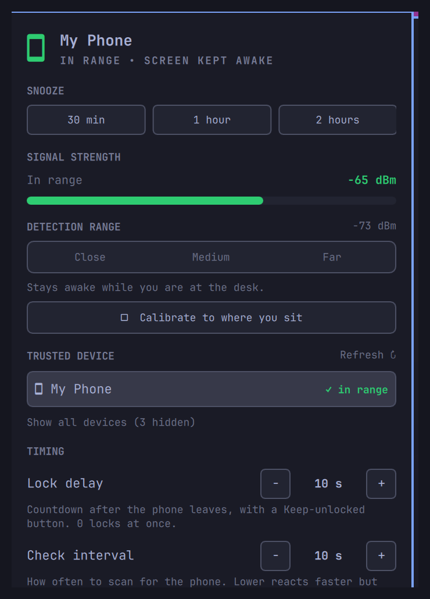

# Bluetooth Proximity Lock for Omarchy (`omarchy-bluetooth-proximity-lock`)

Auto-lock your screen when you walk away with your phone, and keep it awake
while you're nearby. A native **Omarchy 4 (Quattro)** bar widget that uses
Bluetooth signal strength for phone-proximity detection — **no app on the
phone required**, it just uses the existing pairing.



## Features

- **Auto-lock on departure** — runs `omarchy-system-lock` shortly after your
  phone drops out of Bluetooth range (or you turn Bluetooth off / the phone
  powers down). A live countdown first — a notification that ticks down with a
  **"Keep unlocked"** button (and a banner in the panel if it's open); set the
  delay to 0 to lock instantly, or turn immediate lock off to just re-arm the
  normal idle timer.
- **Keep-awake while present** — suppresses the screensaver / idle lock while
  your phone is at the desk, and releases it again when you leave.
- **Run your own commands** — optional `onAwayCommand` / `onReturnCommand`
  shell hooks (e.g. `playerctl pause` / `playerctl play`, DND, brightness).
  `onAwayCommand` runs when the lock commits, not if you keep it unlocked.
- **No phone app** — detection is done entirely on the computer from the
  phone's Bluetooth advertisements. Works whether or not the phone holds an
  active connection (an iPhone usually doesn't).
- **Multiple trusted devices** — track a phone *and* a watch; you're "present"
  if any one of them is in range. One scan covers them all.
- **Snooze** — pause proximity for 30 min / 1 h / 2 h from the panel (or the
  `snooze` IPC verb) when you're leaving your phone across the room.
- **Scan-verified signal** — each check runs a short (~4 s) BLE discovery
  window and trusts *only* a signal heard live during it. BlueZ keeps a
  bonded device's last RSSI forever after it goes silent (a modern iPhone
  keeps beaconing for Find My even with Bluetooth off); this ignores that
  stale value so "phone actually gone" is detected correctly.
- **HID-friendly polling** — the radio is only held for the scan window, then
  left idle for the rest of the interval so bonded mice / keyboards /
  headphones can still reconnect. Raise **Poll Interval** to widen that gap.
- **Multi-monitor safe** — the bar is instantiated per display; one copy does
  the polling and all copies share its result via a state file, so you get
  one notification and one lock, not one per screen.
- **Top-bar widget** — one glanceable phone glyph (green nearby, red away,
  dimmed when paused or the device is unpaired). Middle-click forces a check,
  right-click locks now.
- **Everything in the panel** — device picker (phones / watches; desk
  accessories behind "show all"), live signal meter, Close / Medium / Far
  presets *or* **Calibrate**, steppers for lock delay / check interval /
  dropout tolerance, toggles for immediate-lock / notifications / pause, and
  the two command-hook fields.

## How it behaves

| Situation | Result |
| --- | --- |
| Phone on the desk (connected or not) | **In range** — screen kept awake |
| Walk away with the phone | Signal drops → after the grace count (~30–45 s) → **screen locks** + notification |
| Come back with the phone | **In range** again within ~10–25 s (it never *unlocks* the screen — you do) |
| Turn Bluetooth off / airplane mode / phone powers off | Treated as "walked away" → **locks** after grace |
| Disconnect but stay paired and nearby | **Nothing** — still detected by signal |
| "Forget This Device" / unpair | **Not found** state — tracking pauses, never locks; re-pair to resume |
| Marginal signal at the threshold | Grace absorbs brief dips; pick **Close** or **Far** if you're straddling |

**This is a convenience, not a security control.** Bluetooth signal can be
spoofed by someone in radio range, which would keep the idle lock suppressed
after you've left. Keep a normal idle-lock timeout and lock-on-suspend as the
real backstop.

`onAwayCommand` / `onReturnCommand` are run through a shell — put only commands
you trust there. Runtime state lives in a per-user directory (`$XDG_RUNTIME_DIR`,
or `~/.cache/omarchy-proximity` when that is unset), never a world-writable one.

## Installation

```bash
./setup
```

This symlinks the plugin into `~/.config/omarchy/plugins/`, rescans, and
enables it. Or manually:

```bash
ln -s "$PWD" ~/.config/omarchy/plugins/io.github.thomasvez.proximity
omarchy-shell shell rescanPlugins
omarchy plugin enable io.github.thomasvez.proximity
```

### Pair your phone

Pair the phone with the computer over Bluetooth (iPhone or Android):

```bash
bluetoothctl pair <PHONE_MAC>
bluetoothctl trust <PHONE_MAC>
```

Then click the phone icon in the top bar and select your phone from the
paired-devices list.

## Configuration

All of these are set from the panel. They live in the widget's `shell.json`
entry (under `bar.layout.<section>`) if you'd rather edit by hand.

| Key | Default | Meaning |
| --- | --- | --- |
| `devices` | `[]` | Trusted devices as `[{mac, name}, …]` — present if any is near. Managed by the picker; falls back to the legacy single `targetMac` / `targetName`. |
| `rssiThreshold` | `-78` | Signal (dBm) at/above which a device counts as in range. Higher = must be closer. Set by the presets or Calibrate. |
| `pollIntervalSeconds` | `10` | Seconds between checks. Minimum 8; lower reacts faster but holds the radio more. |
| `awayGraceCount` | `3` | Consecutive missed checks before starting the lock countdown (absorbs pocket dropouts). |
| `immediateLock` | `true` | Lock on departure vs. just re-arming the idle timer. |
| `lockDelaySeconds` | `10` | Live countdown before locking, with a "Keep unlocked" button. `0` = lock at once. |
| `notifyOnStateChange` | `true` | Desktop notification + the lock countdown on in-range / away transitions. |
| `onAwayCommand` | `""` | Shell command run when the lock commits (not on "Keep unlocked"). |
| `onReturnCommand` | `""` | Shell command run when the phone comes back into range. |

## Development

```bash
pytest                       # probe logic + Bluetooth output parsing
node --test tests/*.test.js   # Model.js helpers (glyphs, filter, poll lease)
ruff check scripts/ tests/
```

CI runs all of the above plus shellcheck, manifest validation, and a check
that every `Qt.resolvedUrl()` in the QML resolves to a bundled file.

## License

MIT
